# MyOrg

Программа создана для небольших организаций, которым требуется вести учет рабочих дней и данных сотрудников.

**Диаграмма Базы данных**

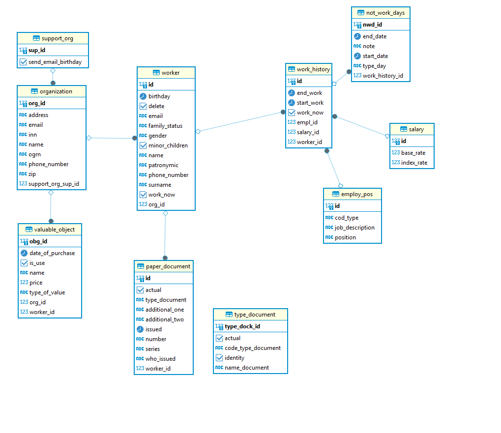

**Стек технологий**
* Spring Boot
* PostgreSQL
* Hibernate
* Spring Data JPA
* JUnit
* Thymeleaf
* StreamApi
* Spring Scheduler

**Для запуска приложения необходимо установить свои настройки подключения к базе данных в application.yaml.**

После запуска, приложение встречает нас главной страницей с предложением выбрать ранее созданную организацию, либо создать новую.
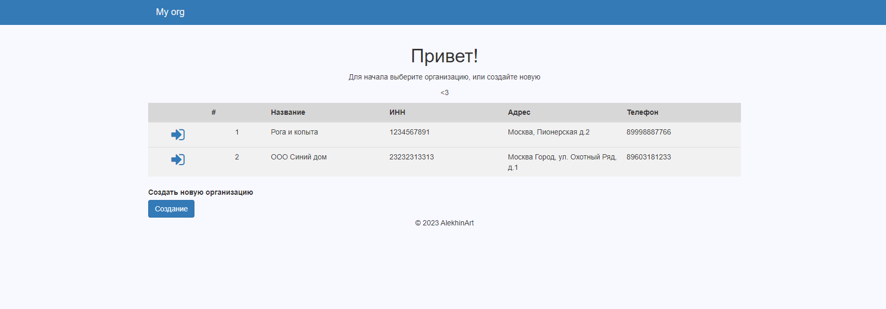
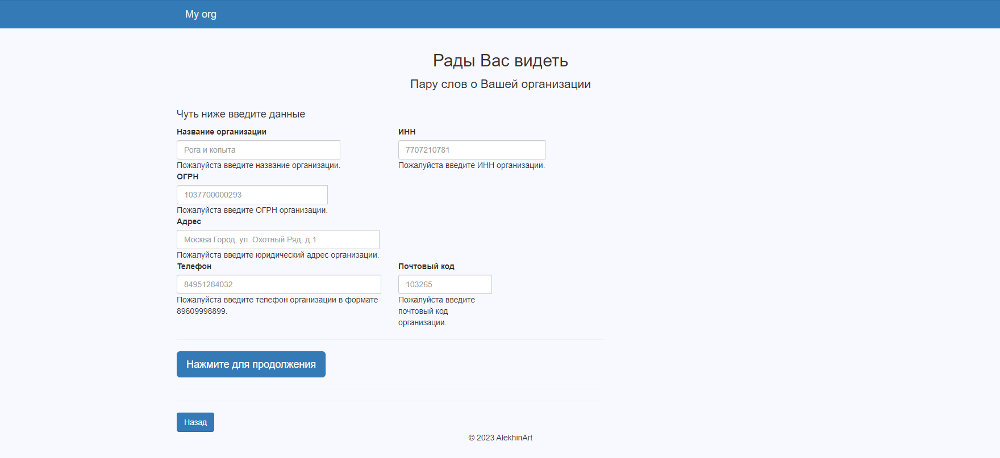

Валидация входных данных на фронт слое не позволит пользователю ввести не правильные данные, либо пропустить какое-либо важное поле
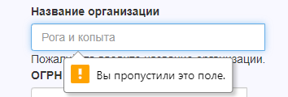

На данный момент из главного функционала доступен учет сотрудников и не большой журнал покупок для нужд организации
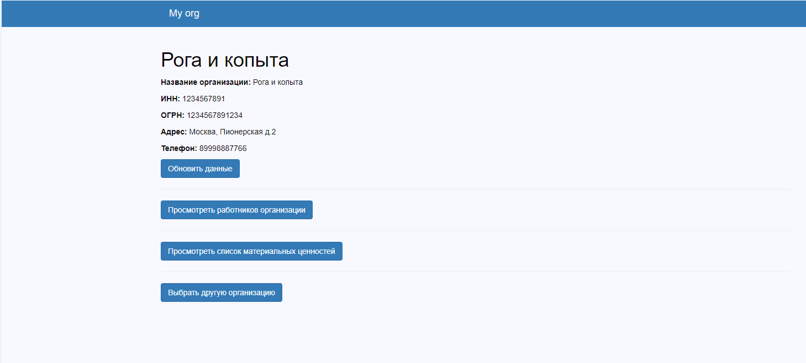

Переходя во вкладку "Просмотреть работников организации" получаем доступ к списку сотрудников, с краткой информацией о них и возможностью поиска сотрудника по различным параметрам
Здесь же: 
* Просмотр полной информации о сотруднике
* Удаление
* Редактирование
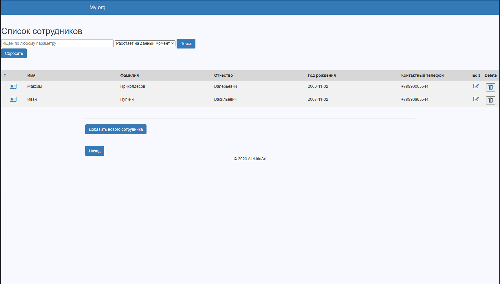

Вкладка полной информации о сотруднике показывает краткое досье о сотруднике.
Паспортные данные можно либо изменить(например в случае ошибки при оформлении), либо заменить на новый.
Здесь же сгруппирована информация о его Истории работы в организации. 
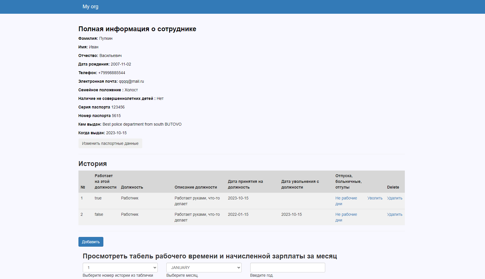

Не рабочие дни (Больничные, отгулы и тд) привязаны к конкретной истории работы сотрудника в определенной должности.
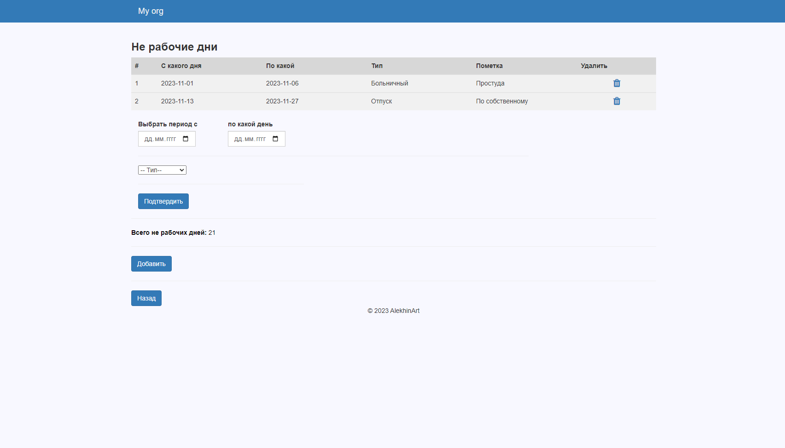
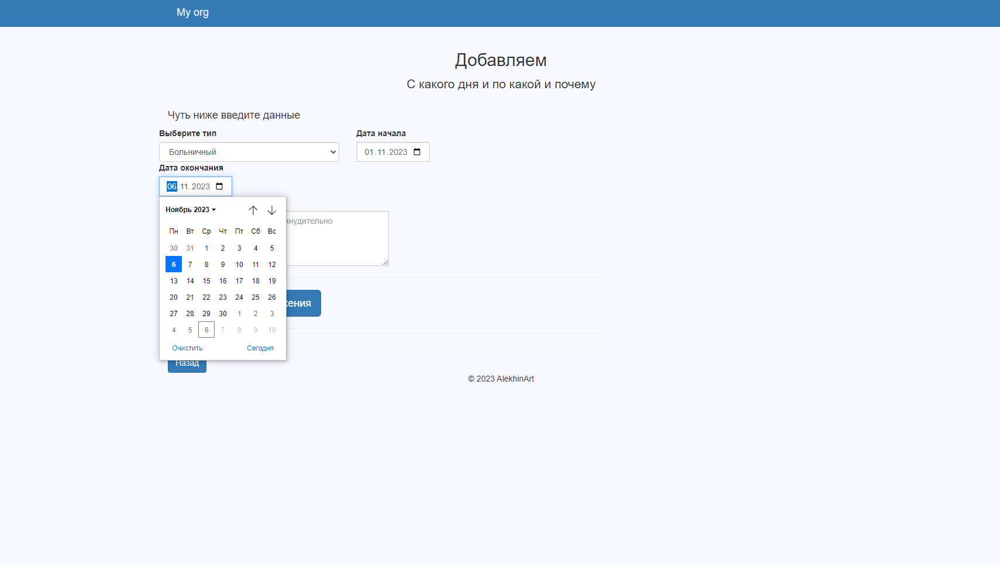

Табель рабочего времени сотрудника выглядит как календарь. 
В нем учитывается:
* Ставка сотрудника при часовой оплате труда и 8 часовом рабочем дне.
* Выходные дни
* Прогулы, больничные, отпуск
* Начало и конец работы в конкретной должности

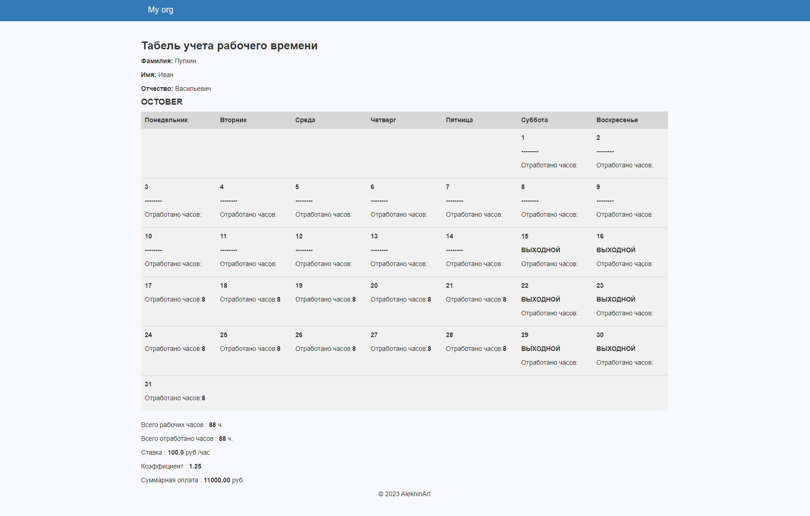
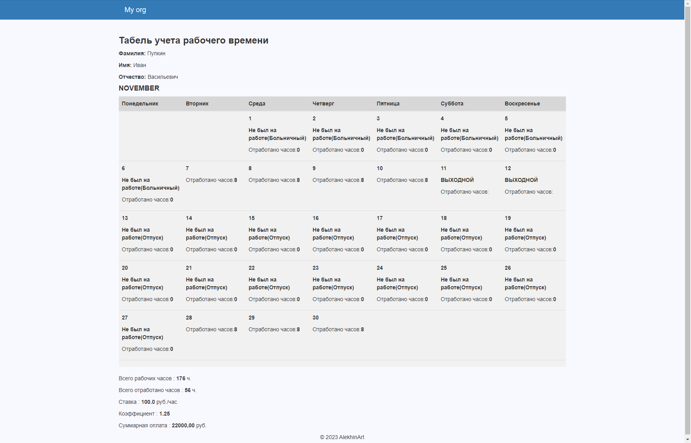

